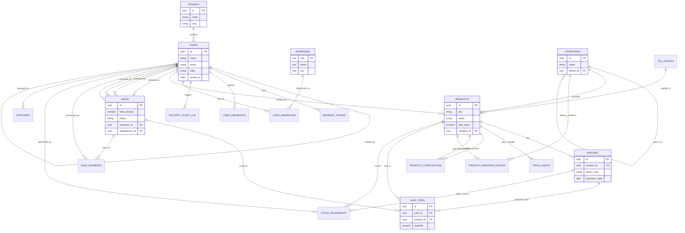

```mermaid
erDiagram
    %% Core Entities
    TENANTS ||--o{ USERS : "contains"
    USERS ||--o{ USERS : "created_by"
    USERS ||--o{ REFRESH_TOKENS : "owns"
    USERS ||--o{ USER_FEEDBACKS : "submits"
    USERS ||--o{ SECURITY_AUDIT_LOG : "triggers"
    
    %% Address System
    ADDRESSES ||--o{ USER_ADDRESSES : "referenced_by"
    USERS ||--o{ USER_ADDRESSES : "lives_at"

    %% Product & Catalog System
    CATEGORIES ||--o{ CATEGORIES : "parent_of"
    CATEGORIES ||--o{ PRODUCTS : "classifies"
    TAX_GROUPS ||--o{ PRODUCTS : "applied_to"
    USERS ||--o{ PRODUCTS : "created_by"
    
    PRODUCTS ||--o{ BATCHES : "has"
    PRODUCTS ||--o{ PRICE_AUDITS : "logs_changes"
    PRODUCTS ||--o{ PRODUCT_COMPOSITIONS : "parent_product"
    PRODUCTS ||--o{ PRODUCT_COMPOSITIONS : "child_product"
    PRODUCTS ||--o{ PRODUCT_MODIFIER_GROUPS : "has_modifiers"
    CATEGORIES ||--o{ PRODUCT_MODIFIER_GROUPS : "defines_modifiers"

    %% Sales System
    SALES ||--o{ SALE_ITEMS : "contains"
    PRODUCTS ||--o{ SALE_ITEMS : "sold_in"
    BATCHES ||--o{ SALE_ITEMS : "deducted_from"
    
    USERS ||--o{ SALES : "salesperson"
    USERS ||--o{ SALES : "customer"
    USERS ||--o{ SALES : "waiter"
    USERS ||--o{ SALES : "cancelled_by"
    
    SALES ||--o{ SALE_PAYMENTS : "paid_by"
    USERS ||--o{ SALE_PAYMENTS : "processed_by"

    %% Inventory & Suppliers
    PRODUCTS ||--o{ STOCK_MOVEMENTS : "moves"
    BATCHES ||--o{ STOCK_MOVEMENTS : "batch_moves"
    USERS ||--o{ STOCK_MOVEMENTS : "performed_by"
    USERS ||--o{ SUPPLIERS : "managed_by"

    USERS {
        uuid id PK
        string name
        string email
        string roles
        uuid tenant_id
    }

    PRODUCTS {
        uuid id PK
        string sku
        string name
        numeric sale_price
        uuid category_id FK
    }

    SALES {
        uuid id PK
        numeric total_amount
        string status
        uuid customer_id FK
        uuid salesperson_id FK
    }

    SALE_ITEMS {
        uuid id PK
        uuid sale_id FK
        uuid product_id FK
        numeric quantity
    }

    BATCHES {
        uuid id PK
        uuid product_id FK
        string batch_code
        date expiration_date
    }

    CATEGORIES {
        uuid id PK
        string name
        uuid parent_id FK
    }

    ADDRESSES {
        text cep PK
        text street
        text city
    }

    TENANTS {
        uuid id PK
        string name
        string cnpj
    }
```
